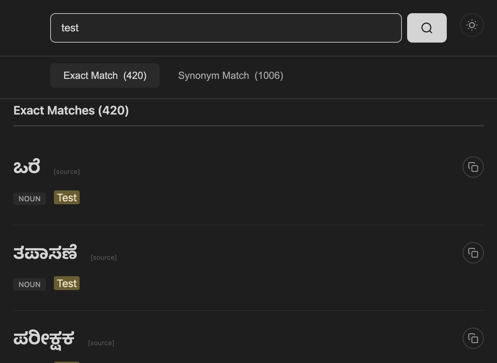

# Rala - English to Kannada Dictionary

[](https://pvnkmrksk.github.io/rala/)
[](https://github.com/pvnkmrksk/rala)
[](https://opendatacommons.org/licenses/odbl/)

**ರಲ** = Reverse [Alar](https://alar.ink)

A fast, offline-capable English → Kannada dictionary combining the best of both worlds:
- **Alar Dictionary** by V. Krishna (156,672 entries)
- **Padakanaja Dictionaries** from Karnataka Government (322,008 entries)

**Total: 478,680 entries | 103,585 unique English words**

🌐 **Live Site**: [https://pvnkmrksk.github.io/rala/](https://pvnkmrksk.github.io/rala/)



## ✨ Features

- ⚡ **Fast Search**: Hybrid architecture with Cloudflare Worker API + local caching
- 🔍 **Smart Matching**: Whole-word matching (no false positives from substrings)
- 🔄 **Word Forms**: Automatic detection of word endings (escalation → escalate, escalating, etc.)
- 🔊 **Audio Pronunciation**: Audio playback for both Alar and Padakanaja entries
- 📱 **Offline Support**: Alar dictionary cached locally for offline use
- 🌙 **Dark Mode**: Built-in dark mode support
- 📱 **PWA**: Installable as a Progressive Web App
- 🎯 **Dual Source**: Combines results from Alar and Padakanaja in real-time

## 🏗️ Architecture

### Frontend
- **Hosting**: Static site on GitHub Pages
- **Framework**: Vanilla JavaScript (no dependencies)
- **Storage**: IndexedDB for offline dictionary caching
- **Audio**: Integrated with [Alar Voice Corpus](https://github.com/Aditya-ds-1806/Alar-voice-corpus) and [Padakanaja Voice Corpus](https://github.com/pvnkmrksk/padakanaja-voice-corpus)

### Backend
- **API**: Cloudflare Worker for Padakanaja dictionary (322k entries)
- **Search**: Fast prefix matching with result ranking
- **Caching**: Response caching for improved performance

### Data Sources
- **Alar**: 156,672 entries loaded client-side (offline-capable)
- **Padakanaja**: 322,008 entries served via Cloudflare Worker API

## 📊 Dictionary Statistics

| Source | Entries | Unique Words | Coverage |
|--------|---------|--------------|----------|
| Alar | 156,672 | ~50,000 | Literary & Classical Kannada |
| Padakanaja | 322,008 | ~53,585 | Modern & Technical Kannada |
| **Total** | **478,680** | **103,585** | **Comprehensive** |

## 🔊 Audio Pronunciation

Rala includes audio pronunciation for dictionary entries:

- **Alar Entries**: Uses [Alar Voice Corpus](https://github.com/Aditya-ds-1806/Alar-voice-corpus) by Aditya-ds-1806
- **Padakanaja Entries**: Uses [Padakanaja Voice Corpus](https://github.com/pvnkmrksk/padakanaja-voice-corpus) (262,260 words)

Audio files are automatically loaded and played when available. The audio button appears next to entries that have pronunciation available.

## 🚀 Quick Start

### Using the Dictionary

1. Visit [https://pvnkmrksk.github.io/rala/](https://pvnkmrksk.github.io/rala/)
2. Type an English word in the search box
3. View Kannada translations from both Alar and Padakanaja
4. Click the 🔊 button to hear pronunciation (when available)

### Local Development

```bash
# Clone the repository
git clone https://github.com/pvnkmrksk/rala.git
cd rala

# Start local server
./test-local.sh

# Or manually
python3 -m http.server 8000
```

Then open [http://localhost:8000](http://localhost:8000) in your browser.

## 🔧 Development

### Project Structure

```
rala/
├── js/
│   ├── config.js          # Configuration and constants
│   ├── utils.js           # Audio URL lookup, search utilities
│   ├── ui.js              # UI rendering and interactions
│   └── search.js           # Search logic
├── workers/
│   └── src/
│       └── index.js        # Cloudflare Worker API
├── padakanaja/            # Padakanaja dictionary data
└── index.html             # Main application
```

### Cloudflare Worker Deployment

The Padakanaja dictionary is served via a Cloudflare Worker for fast, global access:

```bash
cd workers
npx wrangler deploy
```

Update `js/config.js` with your Worker URL after deployment.

### Dictionary Processing

See `scripts/` directory for:
- `scraping/` - Scrapers for Padakanaja dictionaries
- `parsing/` - Scripts to process and optimize dictionary data

## 📚 Data Sources

### Alar Dictionary
- **Source**: [V. Krishna's Alar](https://alar.ink)
- **License**: [ODC-ODbL](https://opendatacommons.org/licenses/odbl/)
- **Entries**: 156,672
- **Format**: YAML (preserved for posterity)
- **Coverage**: Literary and classical Kannada
- **Audio**: [Alar Voice Corpus](https://github.com/Aditya-ds-1806/Alar-voice-corpus)

### Padakanaja Dictionaries
- **Source**: [Karnataka Government Padakanaja Portal](https://padakanaja.karnataka.gov.in/dictionary)
- **Publisher**: Government of Karnataka
- **Entries**: 322,008 (combined from multiple specialized dictionaries)
- **Format**: CSV/JSON (scraped and processed)
- **Coverage**: Modern, technical, and specialized Kannada
- **Audio**: [Padakanaja Voice Corpus](https://github.com/pvnkmrksk/padakanaja-voice-corpus)

## 🎯 Search Features

### Smart Word Matching
- Whole-word matching (no substring false positives)
- Automatic word form detection (escalation → escalate)
- Case-insensitive search
- Prefix matching for fast results

### Result Display
- Combined results from Alar and Padakanaja
- Source attribution for each entry
- Audio playback button (when available)
- Copy to clipboard functionality
- Dark mode support

## 🔗 Related Projects

- **[Alar Dictionary](https://alar.ink)**: Original Kannada-English dictionary
- **[Alar Voice Corpus](https://github.com/Aditya-ds-1806/Alar-voice-corpus)**: Audio pronunciation for Alar entries
- **[Padakanaja Voice Corpus](https://github.com/pvnkmrksk/padakanaja-voice-corpus)**: Audio pronunciation for Padakanaja entries

## 📄 License

- **Alar data**: [ODC-ODbL](https://opendatacommons.org/licenses/odbl/) (Open Data Commons Open Database License)
- **Padakanaja data**: Public domain (Government of Karnataka)
- **Code**: See repository license file

## 🙏 Attribution

- **Alar Dictionary**: Dictionary data by [V. Krishna](https://alar.ink), licensed under [ODC-ODbL](https://opendatacommons.org/licenses/odbl/)
- **Padakanaja Dictionaries**: Sourced from [Karnataka Government Padakanaja Portal](https://padakanaja.karnataka.gov.in/dictionary), maintained by Government of Karnataka
- **Source Data**: [Alar Dictionary Data](https://github.com/alar-dict/data)
- **Alar Voice Corpus**: [Aditya-ds-1806](https://github.com/Aditya-ds-1806/Alar-voice-corpus)
- **Padakanaja Voice Corpus**: [pvnkmrksk](https://github.com/pvnkmrksk/padakanaja-voice-corpus)

## 🤝 Contributing

Contributions are welcome! Areas where help is needed:
- Improving search accuracy
- Adding more word forms
- Performance optimizations
- UI/UX improvements
- Documentation

## 🐛 Known Issues

- Some Padakanaja entries may not have audio (coverage ~85%)
- Large result sets may take a moment to render
- Offline mode works for Alar only (Padakanaja requires API)

## 📞 Support

For issues, questions, or suggestions:
- Open an issue on [GitHub](https://github.com/pvnkmrksk/rala/issues)
- Check existing issues for solutions

---

**Made with ❤️ for the Kannada language community**

**ರಲ** - Making Kannada accessible, one word at a time.
