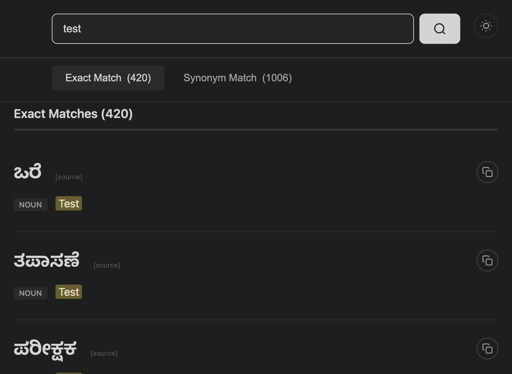

# Rala - English to Kannada Dictionary

[](https://pvnkmrksk.github.io/rala/)
[](https://github.com/pvnkmrksk/rala)
[](https://opendatacommons.org/licenses/odbl/)

**ರಲ** = Reverse [Alar](https://alar.ink)

Rala is a fast, installable English -> Kannada dictionary that combines:
- **Alar** by V. Krishna (156,672 entries)
- **Padakanaja** dictionaries from the Government of Karnataka (322,008 entries)

**Total: 478,680 entries**

Live site: [https://pvnkmrksk.github.io/rala/](https://pvnkmrksk.github.io/rala/)



## Features

- Hybrid search: local Alar + Cloudflare Worker-backed Padakanaja
- Whole-word matching (avoids substring false positives)
- Synonym and word-form expansion with ranking
- Audio playback support (Alar + Padakanaja corpus integration)
- Installable PWA with platform-specific install guidance
- Smart caching policy in service worker (freshness checks + offline fallback)
- Dark mode, copy-to-clipboard, sidebar navigation, glossary page

## Quick Start

```bash
git clone https://github.com/pvnkmrksk/rala.git
cd rala
./test-local.sh
```

Then open [http://localhost:8000](http://localhost:8000).

Run tests:

```bash
npm test
```

## Architecture

### Frontend
- Static app (Vanilla JS + HTML + CSS)
- IndexedDB and cache-first data paths for offline/low-network conditions
- Search UI with controlled autocomplete and delayed suggestion updates

### Backend
- Cloudflare Worker serves/queries Padakanaja search data
- Alar data and reverse index logic run client-side

### Caching strategy
- Navigation requests use a freshness window policy
- Network checks are preferred when stale
- Cache fallback is used when offline or recently refreshed

## Data Sources

### Alar
- Source: [https://alar.ink](https://alar.ink)
- Data: [https://github.com/alar-dict/data](https://github.com/alar-dict/data)
- License: [ODC-ODbL](https://opendatacommons.org/licenses/odbl/)

### Padakanaja
- Source: [https://padakanaja.karnataka.gov.in/dictionary](https://padakanaja.karnataka.gov.in/dictionary)
- Publisher: Government of Karnataka

### Audio
- Alar voice corpus: [Aditya-ds-1806/Alar-voice-corpus](https://github.com/Aditya-ds-1806/Alar-voice-corpus)
- Padakanaja voice corpus: [pvnkmrksk/padakanaja-voice-corpus](https://github.com/pvnkmrksk/padakanaja-voice-corpus)

## Data / Glossary Generation

The glossary list used by autocomplete and glossary browsing is generated with:

```bash
python3 scripts/parsing/generate_glossary_words.py
mv glossary_words.json data/glossary_words.json
```

This script currently merges:
- Alar definition tokens
- Padakanaja English fields (word/meaning/synonyms/administrative word)

## Project Structure

```text
rala/
├── index.html
├── about.html
├── glossary.html
├── js/
│   ├── app.js
│   ├── search.js
│   ├── ui.js
│   ├── pwa.js
│   ├── sidebar.js
│   └── config.js
├── data/
│   └── glossary_words.json
├── scripts/
│   ├── scraping/
│   └── parsing/
├── workers/
│   └── src/index.js
└── service-worker.js
```

## Contributing

Contributions are welcome. If you are starting, please:

1. Open an issue with the bug/feature and expected behavior
2. Create a feature branch from `main`
3. Keep changes focused and include test notes
4. Run `npm test` before opening PR

Good first contribution areas:
- Search ranking and synonym precision
- UI/UX polish for mobile and desktop
- Performance profiling and render smoothness
- Better test coverage for search edge cases
- Script/tooling improvements for dataset refreshes

## Roadmap

### Search quality
- Improve phrase-level synonym precision and explain why each synonym matched
- Add optional strict/relaxed search modes
- Better ranking for dictionary headwords vs long descriptive entries

### UX and accessibility
- Keyboard-first suggestion navigation polish
- Better focus/ARIA semantics for install and suggestion panels
- Improve perceived performance for very large result sets

### Data pipeline
- Unify glossary generation with the same runtime search tokenization rules
- Add repeatable `npm` scripts for data regeneration
- Add validation reports for noisy/low-quality tokens

### Offline and updates
- Add visible app version/update indicator in UI
- Improve update messaging when a new service worker activates
- Fine-tune cache windows based on real usage analytics

### Testing and observability
- Add integration tests for known race conditions
- Add smoke tests for service-worker caching behavior
- Expand Worker API test coverage and fixture-based data checks

## Known Limitations

- Padakanaja offline behavior depends on available cached data/API reachability
- Very large queries can still render slower on low-end devices

## License and Attribution

- Alar data: [ODC-ODbL](https://opendatacommons.org/licenses/odbl/)
- Padakanaja data: Government of Karnataka sources
- Code: see repository license file

Made with love for the Kannada language community.
